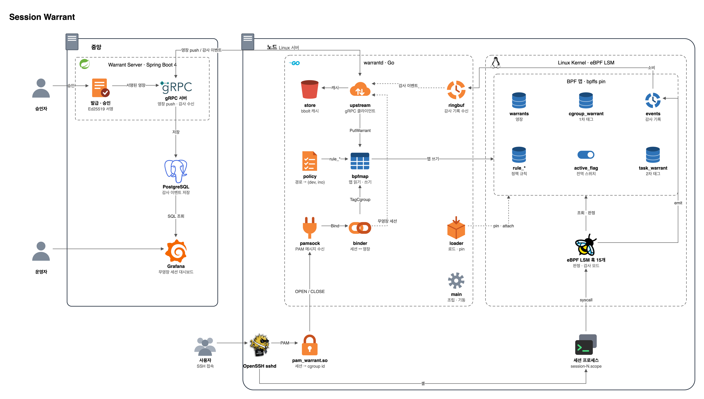

# Session Warrant

[English](README.md) | **한국어**

**범위와 기한이 정해진 SSH 접근을, 셸이 아니라 커널이 집행한다.**

Session Warrant 는 모든 SSH 세션에 *영장(warrant)* 을 붙인다. 누가, 왜, 언제까지,
무엇을 할 수 있는지가 담긴다. 영장은 리눅스 커널 안의 eBPF LSM 훅이 집행하므로
`sudo` · `su` · `nohup` · 백그라운드 작업을 거쳐도 세션을 따라가고, 세션이 열려
있는 동안에도 기한이 되면 만료된다.

게이트웨이형 SSH 접근제어(Teleport · StrongDM · Boundary 등)는 문을 통제한다.
Session Warrant 는 문을 통과한 다음을 통제한다.

> **상태 (2026-10-08):** Ubuntu 24.04 / 커널 6.8 에서 스파이크 S0~S3 을 통과했다.
> 두 겹 태그가 `sudo` · `su` · `nohup` · `systemd-run --scope` 를 거쳐도 유지되고,
> 최악 조건의 `file_open` 오버헤드는 **1% 미만**이며, PAM session 단계에서
> `session-N.scope` 가 이미 확정돼 있다. 커널 판정 코드(훅 15개), PAM 모듈,
> `warrantd` 패키지 4개가 구현돼 있고, 끝에서 끝까지 이어지는 경로(노드 → 서버 →
> 대시보드)를 잇는 중이다. 이번 학기 산출물은 **감사 모드**다. 강제(`-EPERM`)는
> 범위 밖이다. [로드맵](#로드맵) 참조.

## 목차

- [목적](#목적)
- [동작 원리](#동작-원리)
- [아키텍처](#아키텍처)
- [리포지토리 구조](#리포지토리-구조)
- [로드맵](#로드맵)
- [설계 규칙](#설계-규칙)
- [알려진 구멍](#알려진-구멍)
- [기술 스택](#기술-스택)
- [시작하기](#시작하기)
- [문서](#문서)

## 목적

게이트웨이가 구조적으로 못 하는 세 가지를, 이 프로젝트는 호스트에서 한다.

| 게이트웨이의 한계 | 호스트에서 |
|---|---|
| **우회된다.** 직접 등록한 `authorized_keys` 하나, 비상 접속 경로 하나면 게이트웨이를 거치지 않는다. | 영장 없는 세션을 호스트가 거부하거나 신고한다. |
| **세션 안을 못 본다.** 셸을 내주고 나면 `scp` · 포트포워딩 · 비대화형 명령은 프로토콜 계층 밖이다. | `exec` · `connect` · 파일 쓰기를 시스템 콜마다 판정한다. |
| **귀속이 무너진다.** 모두 `ec2-user` 로 들어와 `sudo` 를 하면 커널에는 uid 0 만 보인다. | 모든 행동에 사람 이름이 붙는다. 컨테이너 안에서도. |

솔직하게 말하면, 이 제품은 root 를 *없애지* 않는다. **root 가 하는 일에 사유와 기한을
붙인다.** 커널 익스플로잇이나 부팅 경로 장악은 막지 못한다. 대신 정상 경로로 들어온
사람이 승인 범위를 벗어나는 것을 막고, 그 기록을 위조하기 어렵게 만든다.

### 영장의 모습

```
Session Warrant  W-4821-3F
  Subject     alice@example.com  (login account: ec2-user)
  Reason      INC-4821 payment latency incident
  Targets     prod-payment-{03,04}
  Valid       14:00 → 14:30  (30 min, auto-expires)
  Exec        git, less, tail, journalctl, ps, ss
  Write       denied, except /tmp/w-4821
  Outbound    denied
```

같은 내용을 `rbash` 나 `sudoers` 로 흉내 낼 수는 있지만, 그건 세션 안에서 우회된다.
영장은 LSM 훅이 집행하므로 세션 안에서 뒤집을 수 없다.

### 사용자에게 보이는 모습

영장: `/app` 아래 쓰기 권한, 2시간.

```
[14:03] $ vi /app/config.yml        → 저장됨            /app 디렉터리 inode 아래
[14:05] $ sudo vi /etc/nginx.conf   → :w 실패           uid 0 이어도 소용없다: DAC 다음 LSM
[14:12] $ curl https://evil.sh      → connect: EPERM    아웃바운드가 영장에 없다
[14:20] $ nohup ./deploy.sh &       → 실행됨            태그가 자식을 따라간다
[16:00] 만료                         → 쓰기 · 아웃바운드 거부, 셸은 유지
```

에러는 평범한 `Permission denied` 다. 만료 시 기본 동작은 종료가 아니라
**강등**이다. 권한만 죽고 세션과 작업은 산다. 종료 · 유예 모드는 영장마다 고를 수 있다.

## 동작 원리

### 태그: 두 겹

제품의 성패는 질문 하나에 달려 있다. 태그가 `sudo` · `su` · `nohup` · 백그라운드를
거쳐도 살아남는가? 그래서 두 번 붙인다.

1. **cgroup.** systemd-logind 가 SSH 로그인마다 `session-N.scope` 를 만든다.
   영장은 그 cgroup id 에 건다. 훅 안에서 `bpf_get_current_cgroup_id()` 한 번으로
   찾고, uid 와 무관하다.
2. **fork 전파.** `sched_process_fork` 가 부모의 태그를 자식의 task storage 에
   복사한다. 프로세스가 cgroup 을 떠나는 경우를 막는다.

| 세션에서 한 일 | cgroup | fork 체인 | 태그 |
|---|---|---|---|
| `nohup` · `setsid` · `&` · `sudo` · `su` | 유지 | 유지 | **유지** |
| `systemd-run --scope` | 바뀜 | 유지 | **유지 (2차)** |
| `systemd-run` · `systemctl start` · `at` · `cron` · `docker exec` | 바뀜 | 끊김 | 끊김 |

마지막 줄은 다른 데몬에 일을 맡기는 위임이다. 정책으로 막는다. 실행 허용 목록이 그
바이너리를 거부하고, `socket_connect` 가 systemd · D-Bus · `docker.sock` 으로의
`AF_UNIX` 연결을 거부하며, spool 쓰기는 이미 금지돼 있다. D-Bus 신호를 통한 완전한
승계는 Phase 2 다.

### 만료는 커널 안에서

LSM 판정마다 `bpf_ktime_get_boot_ns()` 와 영장의 `expires_ns` 를 비교한다. 유저
공간 왕복도, 타이머도, 프로세스 순회도 없다. 취소는 1바이트다:
`warrants[id].revoked = 1`. 연장은 `expires_ns` 를 제자리에서 고치고, 열린 세션은
그대로 이어진다.

### 판정 경로

```
① active_flag (CPU별)           ── 활성 영장 없음 ──▶ 통과
② cgroup_id → cgroup_warrant
③ 없으면 → task_warrant          ── 관리 대상 아님 ──▶ 통과
④ warrants: 주체 · 정책 · 만료
⑤ 취소 / 만료 확인               ── 만료 ──────────▶ 강등 규칙으로 판정
⑥ rule_exec · rule_write · rule_net
⑦ 감사 기록 → ringbuf
⑧ enforce && 거부 → -EPERM
```

노드의 거의 모든 호출은 ① 에서 끝난다. ②~⑧ 은 영장이 붙은 세션만 돈다. 해시 조회
서너 번과 정수 비교 몇 번이다. `file_open` 에서는 ② 앞의 `f_mode & FMODE_WRITE`
검사가 호출의 약 95% 를 거른다. 읽기는 통제하지 않기 때문이다.

### 감사와 강제가 함수 하나를 공유한다

```c
SEC("lsm/file_open")             int check(struct file *f) { return verdict(f); }  // 강제
SEC("kprobe/security_file_open") int probe(struct file *f) { verdict(f); return 0; }  // 감사
```

같은 인자, 같은 순간이다. 감사 모드 데이터가 강제 판정과 정확히 같으므로 "감사에서는
괜찮았는데 강제로 켜니 막히더라"가 생길 수 없다.

## 아키텍처

중앙 서버가 영장을 발급한다. `warrantd` 가 그것을 커널 맵에 옮겨 적고, SSH 세션마다
맞는 영장을 붙인다. 커널은 그 맵만 보고 판정한다. **판정 시점에 유저 공간 왕복이
없다.** 중앙이 끊기거나 `warrantd` 가 죽어도 이미 발급된 영장은 계속 만료되고
집행된다.



*목표 아키텍처. 원본: [`docs/architecture.drawio`](docs/architecture.drawio) (draw.io 로 연다).*

### 구성 요소

| 구성 요소 | 언어 | 역할 |
|---|---|---|
| 중앙 서버 | Java / Spring Boot | 승인, 신원, 영장 서명, 감사 저장, 노드로 gRPC push |
| `warrantd` | Go | 정책을 맵 형태로 컴파일(경로 → `(dev, ino)`, CIDR → LPM trie), (호스트, 계정, SSH 키 지문)으로 세션과 영장을 잇기, BPF 로드 · pin, ringbuf 소비, 중앙 단절 대비 bbolt 캐시, 킬스위치 |
| `pam_warrant.so` | C | sshd PAM session 스택에서 `pam_systemd.so` 뒤. `XDG_SESSION_ID` → `session-N.scope` cgroup id 를 구해, 로그인 계정 · `SSH_AUTH_INFO_0` 과 함께 유닉스 데이터그램 소켓으로 `warrantd` 에 보낸다. 기다리지 않고, `warrantd` 에 닿지 못하면 로그인을 허용하고 무영장으로 기록한다 |
| BPF 프로그램 | C | exec · 쓰기 · 아웃바운드 · 자기보호 LSM 훅, fork 전파 tracepoint, 공유 판정 함수 |
| 대시보드 | Grafana | PostgreSQL 을 직접 읽는다: 무영장 세션, 접속 현황 |

### 커널 맵

| 맵 | 종류 | 키 → 값 | 역할 |
|---|---|---|---|
| `active_flag` | `PERCPU_ARRAY` | `0 → u8` | 활성 영장 없음 → 모든 훅이 바로 통과 |
| `cgroup_warrant` | `HASH` | `cgroup_id → warrant_id` | 1차 태그 |
| `task_warrant` | `TASK_STORAGE` | `task → warrant_id` | 2차 태그, fork 때 복사 |
| `warrants` | `HASH` | `warrant_id → struct` | 만료 · 주체 · 정책 · 취소 · 모드 · on_expiry |
| `rule_exec` | `HASH` | `(policy, dev, ino) → u8` | 실행 허용 바이너리 |
| `rule_write` | `HASH` | `(policy, dev, ino) → {effect, recursive}` | 쓰기 규칙, 최장 일치, DENY 우선 |
| `rule_net` | `LPM_TRIE` | `(policy, CIDR) → {proto, ports}` | 아웃바운드 허용 대역 |
| `events` | `RINGBUF` | → 감사 기록 | 판정 결과, `warrantd` 가 소비 |

```c
struct warrant {
    __u64 expires_ns;   // bpf_ktime_get_boot_ns() 기준
    __u64 grace_ns;     // on_expiry == 2 일 때 유예 상한
    __u32 subject_id;
    __u32 policy_id;    // 모든 rule_* 키의 앞부분
    __u8  revoked;      // 1바이트, 즉시 취소
    __u8  mode;         // 0 observe · 1 dryrun · 2 enforce
    __u8  on_expiry;    // 0 강등 · 1 종료 · 2 유예
    __u8  break_glass;  // 비상 영장, 자기보호를 통과하는 유일한 영장
};
```

`mode` 가 영장마다 있으므로, 한 팀이 새 정책을 드라이런하는 동안 나머지는 강제 상태로
둘 수 있다.

### 장애 시 동작

강제 경로는 커널에 있고 **단단하게 실패한다.** 발급 경로는 유저 공간에 있고
**느슨하게 실패한다.** 이 비대칭은 의도한 것이다.

| 상황 | 동작 |
|---|---|
| 중앙 단절 | 캐시된 영장으로 계속 집행. 신규 발급만 멈춘다 |
| `warrantd` 사망 | BPF 가 bpffs 에 pin 돼 있어 집행 · 만료 · 취소가 계속된다. 감사 이벤트만 위험하다 |
| PAM 이 `warrantd` 에 못 붙음 | **로그인을 허용**하고 무영장으로 기록 · 경보. 여기서 fail-close 하면 장애 때 아무도 못 들어간다 |
| BPF 오작동 | 킬스위치 맵 플래그 하나로 모든 훅이 통과한다 |

## 리포지토리 구조

```
proto/    protobuf 스키마 — 영장 구조체의 단일 원본          ← 2026-09-23 확정
bpf/      C · BPF 프로그램 (vmlinux.h 는 gitignore)          ← 훅 15개, wtest.sh 29/29
agent/    Go · warrantd                                       ← bpfmap · ringbuf · pamsock · policy 구현
          cmd/warrantd/ · internal/{loader,bpfmap,pamsock,policy,ringbuf,upstream,store}/
pam/      C · pam_warrant.so, 200줄 이내 유지                 ← sshd 까지 동작 (VM)
server/   Java · Spring Boot 중앙 서버                        ← 엔티티 · Flyway, 서비스 구현 중
web/      React 목업 대시보드 — 동결, Grafana 로 대체          ← 범위 밖
deploy/   bootstrap.sh · enable-bpf-lsm.sh · systemd/ · ansible/ ← 스크립트 동작
bench/    overhead/ (S1) · bypass/ (S2) · pamtiming/ (S3) · inode/ (S4) ← S1~S3 실행됨
docs/     기획 문서, 실험 기록, 아키텍처 다이어그램
```

각 디렉터리의 `README.md` 에 그 계층이 지켜야 할 제약이 적혀 있다.

## 로드맵

### 이번 학기 범위

**산출물: 감사 모드.** 강제는 범위 밖이다. 기획서의 MVP 일정은 3인 5개월을 가정하고,
§09 는 감사 모드에서 멈춰도 제품이 미완성이 아니라고 명시한다. 감사 모드만으로도
영장 없는 접속 탐지와 조직 전체 SSH 접속 현황 리포트가 나온다.

| | 이번 학기 | 범위 밖 |
|---|---|---|
| LSM 훅 | 붙이고 `return 0`, 기록만 | `-EPERM` |
| 두 겹 태그 | cgroup + fork 전파, 검증 | D-Bus 승계 |
| 오버헤드 | 훅별 실측, p99 까지 | — |
| 발급 경로 | 중앙 → `warrantd` → 맵 | Slack 승인 연동 |
| 자기보호 6종 | 설계, 커널 훅은 감사 모드로 붙어 있음 | 강제 |

강제 모드는 자기보호 6종이 전부 붙은 뒤에만 켠다. 하나라도 빠진 채 켜면 verifier 를
통과한 버그 하나로 자기 박스에서 잠긴다.

### 스파이크

던져버리는 코드다. 남는 것은 `bench/` 의 측정 하네스다.

- [x] **S0 · 환경.** `bootstrap.sh` · `enable-bpf-lsm.sh` · `bpf/smoke`. BPF LSM 이 붙고 돈다.
- [x] **S1 · `file_open` 오버헤드.** 훅 없음부터 전체 조회까지의 티어 × 부하 워크로드, p99 까지. 커널 안에서 1회 비용을 재고 호출 수를 곱했다: 쓰기 포화 워크로드에서 **77ns × 40,851회 = 0.36%**, 최악 조건 **1% 미만**. 읽기 지배 워크로드는 쓰기 게이트에서 먼저 끝나 차이가 없다. 무영장 세션도 영장 세션과 비용이 거의 같다(cgroup 조회가 지배적). 앞서 벽시계로 잰 "+2.0%" 는 물리적으로 불가능한 값이라 철회했다.
- [x] **S2 · 태그 전파.** 위 표를 bats 케이스로. 커널 6.8.0 에서 8 통과 · 9 skip · 0 실패. `systemd-run --scope` 가 `cg_tag=0 task_tag=1` 로 나왔다 — 2차 방어선의 존재 이유가 실측으로 확인된 것이다.
- [x] **S3 · PAM 타이밍.** `/etc/pam.d/sshd` 로 `ssh localhost` 11회: 매번 `session-N.scope` 가 이미 있었고, 폴링이 한 번도 돌지 않았다. **태깅 공백 없음.** `XDG_SESSION_ID` 는 재사용되지만 cgroup id 는 아니라는 것도 확인했다 — 영장을 cgroup id 에 거는 이유다. 진짜 세션으로 S2 를 다시 도는 일이 남았다.
- [ ] **S4 · inode 안정성.** 패키지 업그레이드 · `vim` 저장 · logrotate. 하네스는 완성, 아직 안 돌렸다.

### 스파이크 이후 진행

훅은 하나씩 붙였고, 붙일 때마다 verifier 와 오버헤드를 확인했다.

- [x] `sched_process_fork` · `bprm_check_security` · `socket_connect` · `file_open` · `inode_{create,unlink,rename,link,symlink}`
- [x] 자기보호: `lsm/bpf` · `task_kill` · `sb_umount` · `ptrace_access_check` · `kernel_module_request`, 그리고 강제 삽입 규칙인 warrantd 자기 파일 쓰기 금지
- [x] 감사 모드용 `kprobe/security_file_open` 미러
- [ ] `socket_sendmsg` (connect 없는 UDP), 나머지 `kprobe` 미러
- [x] `proto/` 확정 · `pam_warrant.so` · `warrantd` 의 `bpfmap` · `ringbuf` · `pamsock` · `policy`
- [ ] `warrantd` 조립 · `loader` · `store` · `upstream` · 서버 gRPC 와 서비스 · Grafana 패널

다음 마일스톤: **무영장 세션 한 건이 대시보드에 뜬다**, 끝에서 끝까지.

## 설계 규칙

- **읽기는 통제하지 않는다.** 쓰기 · 삭제 · 이름변경만. 그 대가는 아웃바운드 기본 차단으로 치른다. 읽을 수는 있어도 밖으로 보낼 수는 없다.
- **경로가 아니라 `(dev, ino)` 로 식별한다.** 허용 목록은 파일 inode 로 충분하다. **금지 목록은 반드시 디렉터리 inode** 로 건다. 아니면 `mv` 후 재생성으로 뚫린다. bind mount 는 경로 문자열은 속여도 `(dev, ino)` 는 못 속인다.
- **유저 공간에서 판정하지 않는다.** 중앙 → `warrantd` → 맵, 그 뒤로는 커널이 혼자 판정한다.
- **프로그램과 맵은 bpffs 에 pin 한다.** `warrantd` 재시작 중에 태깅 공백이 생기면 안 된다. systemd 유닛에 `Before=sshd.service` 가 필요하다.
- **`pam_warrant.so` 는 `pam_systemd.so` 뒤에 온다.** 그 전에는 scope 가 없다. `/etc/pam.d/sshd` 는 콘솔 접근이 있을 때만 고친다.
- **JSON 이 아니라 protobuf 바이트에 서명한다.** Ed25519 는 JDK 내장.
- **차단은 전건 기록, 허용은 빈도 낮은 훅만** (`exec` · `connect`). ringbuf 유실은 명시적으로 기록한다.
- **실행 허용과 쓰기 허용을 함께 검토한다.** `systemctl` 실행 허용 + `/etc/systemd/system` 쓰기 허용은 임의 코드 실행이다. 정책 컴파일러가 경고해야 한다.
- **BPF 타입 이름에는 `warrant_*` 접두사를 붙인다.** `vmlinux.h` 가 `event` · `task` · `config` 등을 이미 정의한다.
- **"모든 명령을 기록한다"가 아니라 "실행된 모든 프로세스를 사람에게 귀속시켜 기록한다"고 말한다.** `cd` 한 번이면 앞의 말은 반증된다. argv 는 힌트이지 증거가 아니고, 증거는 실행된 바이너리의 inode 다.

## 알려진 구멍

넷 다 감사 모드에서 기록되고, `bench/bypass/known_holes.bats` 에 skip 테스트로
커밋돼 있다. 막지는 못하지만 숨기지도 않는다.

| 구멍 | 원인 | 대응 |
|---|---|---|
| 만료 전에 열어 둔 쓰기 fd | `file_open` 은 열 때만 본다 | `on_expiry=terminate`, 또는 감사만. `file_permission` 은 너무 뜨겁다 |
| `connect` 없는 UDP | `sendto` 는 `socket_connect` 를 거치지 않는다 | `lsm/socket_sendmsg`, 영장이 요구할 때만 붙인다 |
| 다른 데몬으로의 위임 | PID 1 · atd · containerd-shim 이 대신 fork 한다 | 실행 허용 목록 + 소켓 차단 + spool 차단. D-Bus 승계는 Phase 2 |
| `kubectl exec` | 컨테이너 cgroup 에서 태어나 세션 scope 가 없다 | API 서버 감사 웹훅에서 다음 `runc exec` 로 잇는다. Phase 2 |

## 기술 스택

| 계층 | 언어 | 핵심 의존성 |
|---|---|---|
| BPF 프로그램 | C | libbpf · vmlinux.h · clang/LLVM 18+ · CO-RE |
| `warrantd` | Go 1.25+ | cilium/ebpf v0.22 · bpf2go · grpc-go · bbolt · x/sys/unix |
| PAM 모듈 | C | libpam-dev |
| 중앙 서버 | Java 25 | Spring Boot 4.1.1 · Security (OIDC) · Data JPA · Flyway · gRPC 서버 스타터 |
| 데이터베이스 | — | PostgreSQL 18, 감사 이벤트 파티셔닝 |
| 대시보드 | — | PostgreSQL 위의 Grafana |

언어가 넷인 것은 제약이다. BPF 는 C 만 된다. PAM 은 sshd 에 `dlopen` 되므로 Go
런타임을 넣을 수 없다. 서버는 Java 로 정해져 있다. 에이전트가 Rust 가 아니라 Go 인
이유는 "막혔을 때 검색으로 풀리는가"였다.

## 시작하기

개발 기준: 물리 머신 한 대, Ubuntu 24.04.4 LTS, 커널 6.8.0. VM 이 아니다. BPF LSM 은
부팅 파라미터와 커널 BTF 에 묶여 있어서, 가상화 층을 끼우면 모든 실패가 모호해진다.

```sh
./deploy/bootstrap.sh              # 커널 · BTF · lsm=bpf · 툴체인 확인
./deploy/bootstrap.sh --install    # 부족한 것 설치 (22.04 / 24.04)
sudo ./deploy/enable-bpf-lsm.sh    # 지금 lsm= 목록에 ,bpf 를 덧붙인다. 재부팅 필요
make -C bpf && sudo ./bpf/smoke    # S0 스모크 테스트
```

`enable-bpf-lsm.sh` 는 지금 떠 있는 목록에 `,bpf` 만 덧붙인다. `lsm=bpf` 만 단독으로
넣으면 AppArmor 가 빠져 부팅이 깨질 수 있다.

```sh
# S1: file_open 오버헤드 → out/<타임스탬프>/report.txt
cd bench/overhead && make && make check && ./fixture.sh && sudo ./run.sh

# S2: 태그 전파, bats
cd bench/bypass && make check && make && sudo make test

# 중앙 서버 골격
cd server && ./gradlew bootJar
```

### 전제 조건

커널: BPF LSM 이 켜진 Linux 5.15+, cgroup v2, systemd-logind.

## 문서

| 문서 | 내용 |
|---|---|
| [`docs/session-warrant-plan.html`](docs/session-warrant-plan.html) | 개념 · 기획 · 아키텍처 (§01~§19) |
| [`docs/session-warrant-tech-stack.html`](docs/session-warrant-tech-stack.html) | 기술 스택 선택과 근거 |
| [`docs/session-warrant-ebpf-fields.html`](docs/session-warrant-ebpf-fields.html) | BPF 가 뽑아내는 값 전체 목록 |
| [`docs/experiments.md`](docs/experiments.md) | S0~S4 실험 기록. 철회한 결론까지 |
| [`docs/architecture.drawio`](docs/architecture.drawio) | 아키텍처 다이어그램 원본 ([English](docs/architecture.en.drawio)) |
