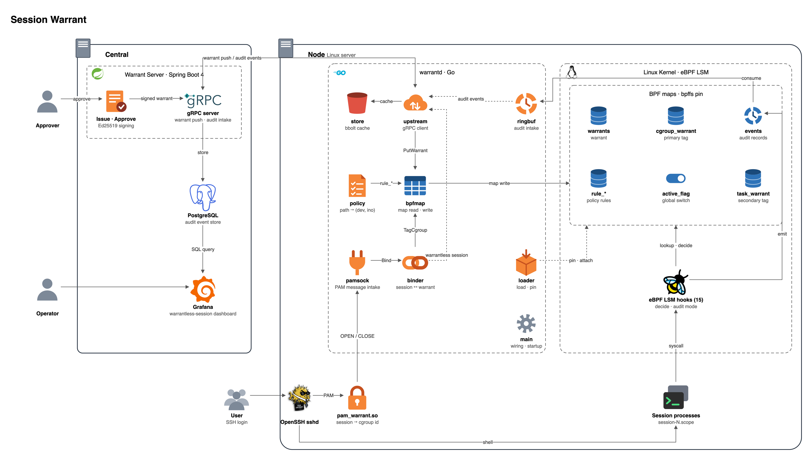

# Session Warrant

**English** | [한국어](README.ko.md)

**Scoped, time-limited SSH access, enforced by the kernel instead of the shell.**

Session Warrant attaches a *warrant* to every SSH session: who is logging in,
why, until when, and what they may do. The warrant is enforced by eBPF LSM
hooks inside the Linux kernel, so it follows the session through `sudo`, `su`,
`nohup` and background jobs, and it expires while the session is still open.

Gateway-style SSH access control (Teleport, StrongDM, Boundary, and similar)
controls the door. Session Warrant controls what happens after the door.

> **Status (2026-10-08):** spikes S0–S3 passed on Ubuntu 24.04 / kernel 6.8.
> The two-layer tag survives `sudo`, `su`, `nohup` and `systemd-run --scope`,
> worst-case `file_open` overhead is **under 1%**, and `session-N.scope` already
> exists when the PAM session hook runs. Kernel verdict code (15 hooks), the PAM
> module and four `warrantd` packages are implemented; the end-to-end path
> (node → server → dashboard) is being wired. This semester's deliverable is
> **audit mode**. Enforcement (`-EPERM`) is out of scope. See [Roadmap](#roadmap).

## Contents

- [Purpose](#purpose)
- [How it works](#how-it-works)
- [Architecture](#architecture)
- [Repository layout](#repository-layout)
- [Roadmap](#roadmap)
- [Design rules](#design-rules)
- [Known gaps](#known-gaps)
- [Tech stack](#tech-stack)
- [Getting started](#getting-started)
- [Documents](#documents)

## Purpose

Three things a gateway structurally cannot do, and this project does on the
host:

| Gateway limit | On the host |
|---|---|
| **Bypassable.** One directly registered `authorized_keys`, one emergency path, and the gateway is out of the loop. | The host refuses, or reports, any session without a warrant. |
| **Blind inside the session.** Once a shell is handed over, `scp`, port forwarding and non-interactive commands are outside the protocol layer. | `exec`, `connect` and file writes are decided per syscall. |
| **Attribution collapses.** Everyone logs in as `ec2-user` and runs `sudo`; the kernel then sees only uid 0. | Every action carries a person's name, including inside containers. |

The honest framing: this does not *remove* root. It **attaches a reason and a
deadline to what root does.** It does not contain a kernel exploit or a
compromised boot path. It does stop a person who came in through the normal
path from stepping outside what was approved, and it makes that record hard to
forge.

### What a warrant is

```
Session Warrant  W-4821-3F
  Subject     alice@example.com  (login account: ec2-user)
  Reason      INC-4821 payment latency incident
  Targets     prod-payment-{03,04}
  Valid       14:00 → 14:30  (30 min, auto-expires)
  Exec        git, less, tail, journalctl, ps, ss
  Write       denied, except /tmp/w-4821
  Outbound    denied
```

The same content can be imitated with `rbash` or `sudoers`, but those are
bypassed from inside the session. A warrant is enforced by LSM hooks and
cannot be overturned from inside the session.

### What it looks like to the user

Warrant: write access under `/app` for two hours.

```
[14:03] $ vi /app/config.yml        → saved             under /app's directory inode
[14:05] $ sudo vi /etc/nginx.conf   → :w fails          uid 0 does not help: DAC first, then LSM
[14:12] $ curl https://evil.sh      → connect: EPERM    outbound not in warrant
[14:20] $ nohup ./deploy.sh &       → runs              tag follows the child
[16:00] expiry                      → writes and outbound refused, shell stays open
```

Errors are the ordinary `Permission denied`. At expiry the default is
**downgrade**, not kill: privileges die, the session and its jobs live.
Terminate and grace modes are per-warrant options.

## How it works

### The tag: two layers

The product stands or falls on one question: does the tag survive `sudo`,
`su`, `nohup` and backgrounding? It is applied twice.

1. **cgroup.** systemd-logind creates `session-N.scope` for every SSH login.
   The warrant is keyed on that cgroup id. One `bpf_get_current_cgroup_id()`
   in the hook resolves it, independent of uid.
2. **fork propagation.** `sched_process_fork` copies the parent's tag into the
   child's task storage. Covers the cases where a process leaves its cgroup.

| Action from the session | cgroup | fork chain | tag |
|---|---|---|---|
| `nohup` · `setsid` · `&` · `sudo` · `su` | kept | kept | **kept** |
| `systemd-run --scope` | changed | kept | **kept (2nd layer)** |
| `systemd-run` · `systemctl start` · `at` · `cron` · `docker exec` | changed | broken | broken |

The last row is delegation to another daemon. It is closed by policy: the exec
allowlist refuses those binaries, `socket_connect` refuses `AF_UNIX`
connections to systemd, D-Bus and `docker.sock`, and spool writes are already
denied. Full succession over D-Bus signals is Phase 2.

### Expiry inside the kernel

Every LSM decision compares `bpf_ktime_get_boot_ns()` against the warrant's
`expires_ns`. No user-space round trip, no timer, no process walk. Revocation
is one byte: `warrants[id].revoked = 1`. Extension updates `expires_ns` in
place and the open session continues.

### Decision path

```
① active_flag (per-CPU)          ── no active warrant ──▶ pass
② cgroup_id → cgroup_warrant
③ miss → task_warrant            ── not managed ────────▶ pass
④ warrants: subject · policy · expiry
⑤ revoked / expired check        ── expired ────────────▶ decide with downgrade rules
⑥ rule_exec · rule_write · rule_net
⑦ audit record → ringbuf
⑧ enforce && deny → -EPERM
```

Almost everything on the node exits at ①. Only warranted sessions run ②–⑧:
three or four hash lookups and a few integer compares. In `file_open`, a
`f_mode & FMODE_WRITE` test in front of ② filters roughly 95% of calls, because
reads are not controlled.

### Audit and enforcement share one function

```c
SEC("lsm/file_open")             int check(struct file *f) { return verdict(f); }  // enforce
SEC("kprobe/security_file_open") int probe(struct file *f) { verdict(f); return 0; }  // audit
```

Same arguments, same moment. Audit-mode data matches enforcement decisions
exactly, so "fine in audit, blocked in enforcement" cannot happen.

## Architecture

The central server issues warrants. `warrantd` copies them into kernel maps
and binds each SSH session to its warrant. The kernel decides using only those
maps. **No user-space round trip at decision time.** If the central server is unreachable or `warrantd` dies,
already issued warrants keep expiring and enforcing.



*Target architecture. Source: [`docs/architecture.en.drawio`](docs/architecture.en.drawio) (open with draw.io).*

```
 CONTROL PLANE               NODE · USER SPACE                 NODE · KERNEL
 ┌──────────────────┐        ┌──────────────────┐             ┌──────────────────────────┐
 │ issue · approve  │ push   │ warrantd         │ map write   │ BPF maps                 │
 │ identity (OIDC)  │ ─────▶ │  policy compile  │ ──────────▶ │  cgroup_warrant          │
 │ Ed25519 signing  │ gRPC   │  session binding │             │  task_warrant            │
 │                  │        │  ringbuf consumer│             │  warrants (exp·rev·mode) │
 │ audit store      │ ◀───── │  warrant cache   │ ◀────────── │  rule_exec/write/net     │
 │ (PostgreSQL)     │ events │                  │  ringbuf    │  events (ringbuf)        │
 └──────────────────┘        └──────────────────┘             ├──────────────────────────┤
                                      ▲ unix socket           │ BPF programs             │
                             ┌──────────────────┐             │  lsm/bprm_check_security │
                             │ sshd             │             │  lsm/file_open · inode_* │
                             │  pam_warrant.so  │  syscall    │  lsm/socket_connect      │
                             │  bash·sudo·vim   │ ──────────▶ │  tp/sched_process_fork   │
                             └──────────────────┘             └──────────────────────────┘
```

### Components

| Component | Language | Role |
|---|---|---|
| Central server | Java / Spring Boot | Approval, identity, warrant signing, audit store, gRPC push to nodes |
| `warrantd` | Go | Compiles policy into map form (paths → `(dev, ino)`, CIDRs → LPM trie), binds sessions to warrants by (host, account, SSH key fingerprint), loads and pins BPF, consumes the ringbuf, keeps a bbolt cache for central outages, owns the kill switch |
| `pam_warrant.so` | C | In sshd's PAM session stack, after `pam_systemd.so`. Resolves `XDG_SESSION_ID` → `session-N.scope` cgroup id and sends it with the login account and `SSH_AUTH_INFO_0` to `warrantd` over a Unix datagram socket. Never blocks; if `warrantd` is unreachable the login is allowed and recorded as warrantless |
| BPF programs | C | LSM hooks for exec, write, egress and self-protection; tracepoint for fork propagation; the shared verdict function |
| Dashboard | Grafana | Reads PostgreSQL directly: warrantless sessions, access report |

### Kernel maps

| Map | Type | Key → Value | Role |
|---|---|---|---|
| `active_flag` | `PERCPU_ARRAY` | `0 → u8` | No active warrant → every hook passes at once |
| `cgroup_warrant` | `HASH` | `cgroup_id → warrant_id` | Primary binding |
| `task_warrant` | `TASK_STORAGE` | `task → warrant_id` | Secondary binding, copied on fork |
| `warrants` | `HASH` | `warrant_id → struct` | Expiry, subject, policy, revoked, mode, on_expiry |
| `rule_exec` | `HASH` | `(policy, dev, ino) → u8` | Allowed binaries |
| `rule_write` | `HASH` | `(policy, dev, ino) → {effect, recursive}` | Write rules, longest match, DENY wins |
| `rule_net` | `LPM_TRIE` | `(policy, CIDR) → {proto, ports}` | Allowed outbound ranges |
| `events` | `RINGBUF` | → audit record | Verdicts, consumed by `warrantd` |

```c
struct warrant {
    __u64 expires_ns;   // relative to bpf_ktime_get_boot_ns()
    __u64 grace_ns;     // grace ceiling when on_expiry == 2
    __u32 subject_id;
    __u32 policy_id;    // prefix of every rule_* key
    __u8  revoked;      // one byte, immediate revocation
    __u8  mode;         // 0 observe · 1 dryrun · 2 enforce
    __u8  on_expiry;    // 0 downgrade · 1 terminate · 2 grace
    __u8  break_glass;  // emergency warrant, the only one past self-protection
};
```

`mode` is per warrant, so one team can dry-run a new policy while the rest of
the node stays enforced.

### Failure behavior

The enforcement path lives in the kernel and **fails hard**. The issuance path
lives in user space and **fails soft**. This asymmetry is deliberate.

| Situation | Behavior |
|---|---|
| Central server unreachable | Cached warrants keep enforcing. Only new issuance stops |
| `warrantd` dies | BPF is pinned to bpffs; enforcement, expiry and revocation continue. Only audit events are at risk |
| PAM cannot reach `warrantd` | **Allow the login**, record it as warrantless, alert. Fail-closed here would lock everyone out during an outage |
| BPF misbehaves | One kill-switch map flag makes every hook pass |

## Repository layout

```
proto/    protobuf schema — single source of truth for the warrant struct  ← finalized 2026-09-23
bpf/      C · BPF programs (vmlinux.h is gitignored)                      ← 15 hooks, wtest.sh 29/29
agent/    Go · warrantd                                                     ← bpfmap · ringbuf · pamsock · policy done
          cmd/warrantd/ · internal/{loader,bpfmap,pamsock,policy,ringbuf,upstream,store}/
pam/      C · pam_warrant.so, kept under 200 lines                          ← works through sshd (VM)
server/   Java · Spring Boot central server                                 ← entities · Flyway; services in progress
web/      React mock dashboard — frozen, replaced by Grafana                ← out of scope
deploy/   bootstrap.sh · enable-bpf-lsm.sh · systemd/ · ansible/            ← scripts work
bench/    overhead/ (S1) · bypass/ (S2) · pamtiming/ (S3) · inode/ (S4)      ← S1–S3 run
docs/     planning documents (Korean), experiment log, architecture diagram
```

Each directory's `README.md` states the constraints that layer must respect.

## Roadmap

### Scope for this semester

**Deliverable: audit mode.** Enforcement is out of scope. The plan's own MVP
schedule assumes three people over five months, and its §09 states that
stopping at audit mode does not leave the product incomplete: it still yields
warrantless-session detection and an organization-wide SSH access report.

| | This semester | Out of scope |
|---|---|---|
| LSM hooks | Attached, `return 0`, record only | `-EPERM` |
| Two-layer tag | cgroup + fork propagation, verified | D-Bus succession |
| Overhead | Measured per hook, through p99 | — |
| Issuance path | Central → `warrantd` → maps | Slack approval integration |
| Self-protection (6) | Designed; kernel hooks in place, audit only | Enforced |

Enforcement is enabled only after all six self-protection hooks are in place.
With one missing, a single verifier-passing bug locks you out of your own box.

### Spikes

Throw-away code. What survives is the harness under `bench/`.

- [x] **S0 · Environment.** `bootstrap.sh`, `enable-bpf-lsm.sh`, `bpf/smoke`. BPF LSM attaches and runs.
- [x] **S1 · `file_open` overhead.** Tiers from no hook to full lookups × load workloads, through p99. Measured inside the kernel per call, then multiplied by call count: **77 ns × 40,851 calls = 0.36%** on a write-saturated workload, **under 1%** worst case. Read-dominated workloads show no difference because the write gate stops them first. A warrantless session costs almost the same as a warranted one (the cgroup lookup dominates). An earlier "+2.0%" wall-clock figure was withdrawn as physically impossible.
- [x] **S2 · Tag propagation.** The table above as bats cases. 8 pass, 9 skip, 0 fail on kernel 6.8.0. `systemd-run --scope` came out `cg_tag=0 task_tag=1`, which is the measured justification for the second layer.
- [x] **S3 · PAM timing.** `ssh localhost` 11 times through `/etc/pam.d/sshd`: `session-N.scope` already existed every time, no polling, **no tagging gap**. Also found that `XDG_SESSION_ID` is reused while the cgroup id is not, which is why warrants are keyed on the cgroup id. S2 still to be re-run against a real session.
- [ ] **S4 · Inode stability.** Package upgrade, `vim` save, logrotate. Harness ready, not yet run.

### Progress after the spikes

Hooks were attached one at a time, each with verifier and overhead checked.

- [x] `sched_process_fork`, `bprm_check_security`, `socket_connect`, `file_open`, `inode_{create,unlink,rename,link,symlink}`
- [x] Self-protection: `lsm/bpf`, `task_kill`, `sb_umount`, `ptrace_access_check`, `kernel_module_request`, plus own-file write denial as a forced rule
- [x] `kprobe/security_file_open` mirror for audit mode
- [ ] `socket_sendmsg` (UDP without connect), remaining `kprobe` mirrors
- [x] `proto/` finalized · `pam_warrant.so` · `warrantd` packages `bpfmap`, `ringbuf`, `pamsock`, `policy`
- [ ] `warrantd` assembly, `loader`, `store`, `upstream` · server gRPC and services · Grafana panels

Next milestone: **one warrantless session shows up on the dashboard**, end to end.

## Design rules

- **Reads are not controlled.** Only write, delete and rename. The price is paid by blocking outbound by default: you can read, but not send it out.
- **Identify by `(dev, ino)`, not path.** Allowlists may key on file inodes. **Denylists must key on directory inodes**, or `mv` and recreate bypasses them. Bind mounts defeat path strings but not `(dev, ino)`.
- **Never decide in user space.** Central → `warrantd` → maps, and the kernel decides alone after that.
- **Pin programs and maps to bpffs.** `warrantd` restarts must not open a tagging gap. The systemd unit needs `Before=sshd.service`.
- **`pam_warrant.so` comes after `pam_systemd.so`.** Before that, the scope does not exist. Edit `/etc/pam.d/sshd` only with console access.
- **Sign the protobuf bytes, not JSON.** Ed25519 from the JDK.
- **Log every denial; log allows only for low-frequency hooks** (`exec`, `connect`). Record ringbuf loss explicitly.
- **Review exec and write allowlists together.** `systemctl` allowed plus `/etc/systemd/system` writable is arbitrary code execution. The policy compiler must warn.
- **BPF type names are prefixed `warrant_*`.** `vmlinux.h` already defines `event`, `task`, `config` and the rest.
- **Say "attributes every executed process to a person", never "records every command".** One `cd` refutes the second. argv is a hint, not evidence; the executed binary's inode is.

## Known gaps

All four are recorded in audit mode and committed as skipped tests in
`bench/bypass/known_holes.bats`. Not blocked, but not invisible.

| Gap | Cause | Answer |
|---|---|---|
| Write fd opened before expiry | `file_open` sees only the open | `on_expiry=terminate`, or audit only. `file_permission` is too hot |
| UDP without `connect` | `sendto` skips `socket_connect` | `lsm/socket_sendmsg`, attached only when the warrant asks |
| Delegation to another daemon | PID 1, atd, containerd-shim fork on the caller's behalf | Exec allowlist + socket block + spool block. D-Bus succession in Phase 2 |
| `kubectl exec` | Born in the container cgroup, no session scope | Bind from the API-server audit webhook to the next `runc exec`. Phase 2 |

## Tech stack

| Layer | Language | Key dependencies |
|---|---|---|
| BPF programs | C | libbpf · vmlinux.h · clang/LLVM 18+ · CO-RE |
| `warrantd` | Go 1.25+ | cilium/ebpf v0.22 · bpf2go · grpc-go · bbolt · x/sys/unix |
| PAM module | C | libpam-dev |
| Central server | Java 25 | Spring Boot 4.1.1 · Security (OIDC) · Data JPA · Flyway · gRPC server starter |
| Database | — | PostgreSQL 18, partitioned audit events |
| Dashboard | — | Grafana on PostgreSQL |

Four languages is a constraint. BPF is C only. PAM is `dlopen`ed into sshd,
so no Go runtime there. The server is Java by decision. Go rather than Rust for
the agent because the criterion was "when stuck, does a search unblock you".

## Getting started

Development target: one physical machine, Ubuntu 24.04.4 LTS, kernel 6.8.0.
Not a VM, because BPF LSM depends on boot parameters and kernel BTF and a
virtualization layer makes every failure ambiguous.

```sh
./deploy/bootstrap.sh              # check kernel · BTF · lsm=bpf · toolchain
./deploy/bootstrap.sh --install    # install what is missing (22.04 / 24.04)
sudo ./deploy/enable-bpf-lsm.sh    # append ,bpf to the running lsm= list, then reboot
make -C bpf && sudo ./bpf/smoke    # S0 smoke test
```

`enable-bpf-lsm.sh` appends `,bpf` to the currently active list. Writing
`lsm=bpf` alone drops AppArmor and can break boot.

```sh
# S1: file_open overhead → out/<timestamp>/report.txt
cd bench/overhead && make && make check && ./fixture.sh && sudo ./run.sh

# S2: tag propagation, bats
cd bench/bypass && make check && make && sudo make test

# central server skeleton
cd server && ./gradlew bootJar
```

### Prerequisites

Kernel prerequisites: Linux 5.15+ with BPF LSM, cgroup v2, systemd-logind.

## Documents

Planning documents are in Korean.

| Document | Contents |
|---|---|
| [`docs/session-warrant-plan.html`](docs/session-warrant-plan.html) | Concept, plan and architecture (§01–§19) |
| [`docs/session-warrant-tech-stack.html`](docs/session-warrant-tech-stack.html) | Technology choices and rationale |
| [`docs/session-warrant-ebpf-fields.html`](docs/session-warrant-ebpf-fields.html) | Every value the BPF programs extract |
| [`docs/experiments.md`](docs/experiments.md) | S0–S4 experiment log, including withdrawn conclusions |
| [`docs/architecture.en.drawio`](docs/architecture.en.drawio) | Architecture diagram source ([한국어](docs/architecture.drawio)) |
